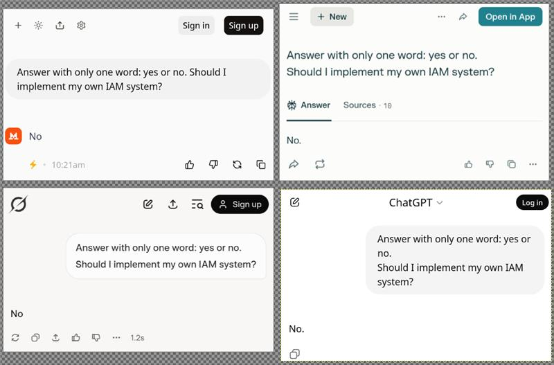
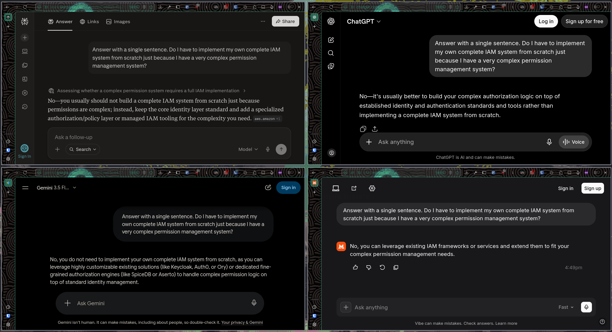

# 🐧 chroot

pet tux:


## 💽 `lsblk`

```
NAME                    RM      SIZE RO TYPE  MOUNTPOINTS

cocosig                  0 ~TREE(3)G  0 disk
├─m0nk3ycl4p             0  TREE(2)G  0 part  /brain
├─f0ssd3v                0  TREE(3)G  0 part  /soul
├─🥖                     0       ???  0 part  /home
├─🦶                     0       ???  0 part  /run
└─🪭                     0      512M  0 part  /survive
computer                 0       ???  0 disk
├─linux                  0       ???  0 part  /kernel
├─4rchbtw                0       ???  0 part  /distro
├─hyprland               0       ???  1 part  /wm
└─crkbd                  0       ???  1 part  /kb
  └─ergol                0       ???  1 part  /kb_layout
```

## 💀 Non-negotiable Truths

- [There is nothing more permanent than a temporary solution](https://en.wiktionary.org/wiki/there_is_nothing_more_permanent_than_a_temporary_solution)
- Should you implement your own IAM system from scratch?

- Do I have to implement my own complete IAM system from scratch just because I have a very complex permission management system?


> [!WARNING]
> Don't bother asking me for help if you are struggling with a *particular in-house IAM system* that does not even comply with [OAuth 2.0](https://www.rfc-editor.org/info/rfc6749/) or [OIDC](https://openid.net/foundation/how-connect-works/).
>
> That said... I can show you where the trash can is 🗑️.
